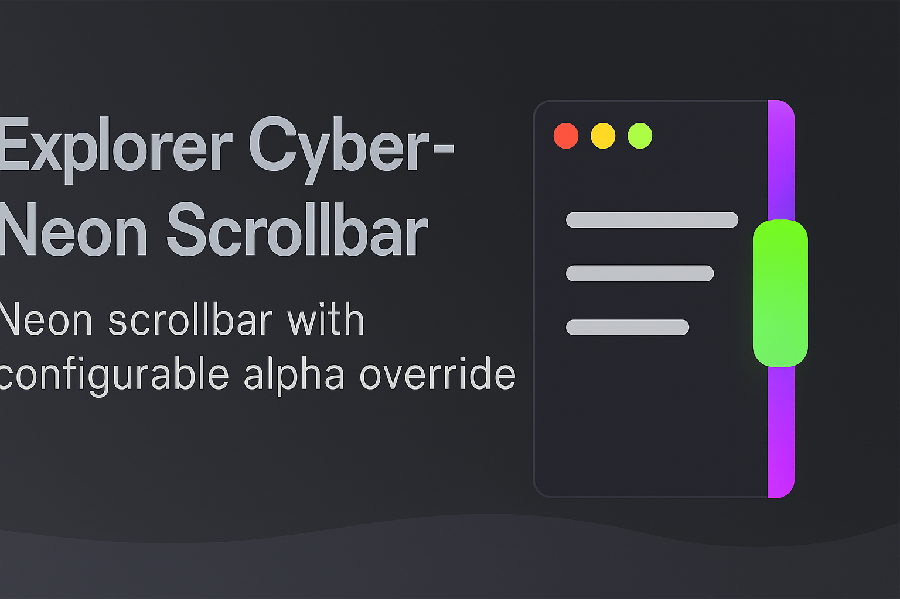

# 🌀 Explorer Cyber-Neon Scrollbar (Configurable Alpha Override)

> Neon scrollbar mod for Windows Explorer with configurable glow and alpha override.

Mod Windhawk ini menggambar scrollbar neon di Windows Explorer dengan efek glow dan kontrol alpha manual untuk area yang mencurigakan.

This Windhawk mod draws neon scrollbars in Windows Explorer with glow effects and manual alpha control for suspicious areas.

---

## 🎨 Fitur / Features

- Thumb hijau neon dengan glow dinamis  
  Neon green thumb with dynamic glow

- Track ungu transparan yang bisa disesuaikan  
  Translucent purple track with adjustable alpha

- Safe mode: auto override alpha di area mencurigakan  
  Safe mode: auto alpha override in suspicious UI regions

- Konfigurasi penuh via Windhawk UI  
  Fully configurable via Windhawk UI

---

## ⚙️ Konfigurasi / Configuration

| Nama | Fungsi | Name | Description |
|------|--------|------|-------------|
| `track.alpha` | Transparansi track (0–255) | Track alpha | Track transparency |
| `thumb.alpha` | Transparansi thumb | Thumb alpha | Thumb visibility |
| `glow.size` | Ukuran glow | Glow size | Outer glow radius |
| `safeMode` | Aktifkan override otomatis | Safe mode | Enable auto override |
| `overrideAlpha` | Nilai alpha override | Override alpha | Alpha value for suspicious areas |

---

## 📦 Instalasi / Installation

1. Buka Windhawk  
   Open Windhawk

2. Klik “Install mod from file”  
   Click “Install mod from file”

3. Pilih file `explorer-neon-scroll-configurable.wh.cpp`  
   Select `explorer-neon-scroll-configurable.wh.cpp`

4. Aktifkan dan sesuaikan konfigurasi sesuai preferensi  
   Enable and adjust settings as needed

---

## 🧪 Catatan Teknis / Technical Notes

- Hook pada `DrawThemeBackground` dari `uxtheme.dll`  
  Hooks `DrawThemeBackground` from `uxtheme.dll`

- Menggunakan GDI+ untuk rendering glow dan rounded thumb  
  Uses GDI+ for glow and rounded thumb rendering

- Tidak mengubah registry atau driver  
  Does not modify registry or drivers

---

## 🛠️ Credits

Dikembangkan oleh **Moch. Khozin & Copilot**  
Developed by **Moch. Khozin & Copilot**

Mod ini dibuat untuk komunitas modding dan troubleshooting lokal  
This mod was built for the local modding and troubleshooting community
---
🔝 [Kembali ke atas / Back to top](#-explorer-cyber-neon-scrollbar-configurable-alpha-override)

