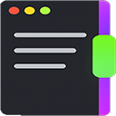

# 🌀 Explorer Cyber-Neon Scrollbar

---

## ✨ Fitur Utama

- 🌈 Scrollbar neon dengan thumb hijau dan track ungu transparan
- ⚙️ Konfigurasi manual RGBA untuk track, thumb, dan glow
- 🛡️ Safe mode: override alpha otomatis di area UI yang mencurigakan
- 🧪 Track overlay opsional untuk eksperimen visual

---

## 📦 File Mod

| File | Deskripsi |
|------|-----------|
| `.wh.cpp` | Source code mod |
| `.wh.json` | Metadata Windhawk |
| `icon.png` | Ikon mod |
| `banner.png` | Banner showcase |
| `README.md` | Dokumentasi bilingual |
| `LICENSE` | Lisensi MIT |
| `.gitignore` | Filter file build/temp |

---

## 🔗 Tautan

- [GitHub Repository](https://github.com/M-KHOZIN/windhawk-explorer-neon-scrollbar)
- [Windhawk Catalog Entry](https://windhawk.net/mods/explorer-neon-scroll-configurable)
