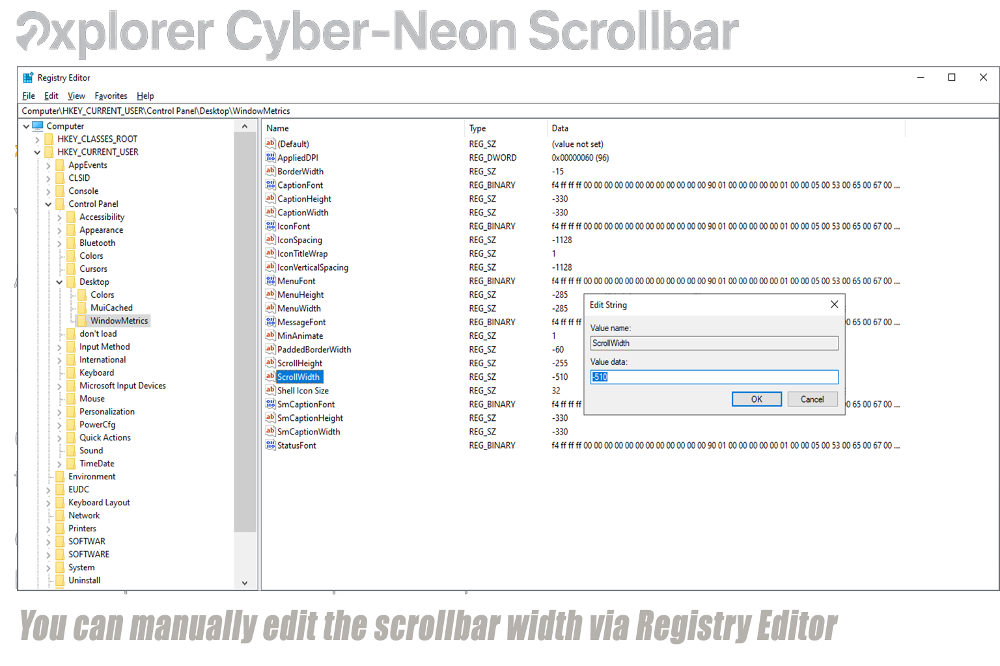

# 🧩 Scrollbar Width Tweaks (.reg)

**EN:** These registry scripts adjust the width of scrollbars in classic Windows apps like File Explorer.  
**ID:** Skrip registry ini mengatur lebar scrollbar di aplikasi klasik Windows seperti File Explorer.

## 📦 Available Presets / Preset yang Tersedia

| File Name             | Width (px) | Description / Deskripsi                          |
|-----------------------|------------|--------------------------------------------------|
| scrollbar-default.reg | ~17 px     | EN: Restore to Windows default  
ID: Kembali ke bawaan Windows |
| scrollbar-400.reg     | ~27 px     | EN: Medium width  
ID: Lebar sedang |
| scrollbar-510.reg     | ~34 px     | EN: Comfortable width (recommended)  
ID: Lebar nyaman (disarankan) |
| scrollbar-600.reg     | ~40 px     | EN: Extra wide  
ID: Lebar maksimal |

## 🛠 How to Use / Cara Menggunakan

**EN:**
1. Double-click the `.reg` file
2. Click **Yes** to confirm
3. Restart your PC

**ID:**
1. Klik dua kali file `.reg`
2. Klik **Yes** untuk konfirmasi
3. Restart komputer

## 🖼️ Manual Registry Edit (Optional)

**EN:** You can manually edit the scrollbar width via Registry Editor.  
**ID:** Anda dapat mengedit lebar scrollbar secara manual melalui Registry Editor.

**Langkah | Step**
1. Start Windows / Keyboard (Klick Start tombol windows / di keyboard): `CMD + R`, `type:` `regedit`, `Enter`.
2. Pergi ke | Go to :
- 📍 Lokasi | Path :
     `HKEY_CURRENT_USER\Control Panel\Desktop\WindowMetrics`

🔧 Keys to edit:
- `ScrollWidth`
- `ScrollHeight`

🖼️ Screenshot:

**EN:** Double-click `ScrollWidth`, enter a new value (e.g. `-510`), click OK, then restart your PC.  
**ID:** Klik dua kali `ScrollWidth`, masukkan nilai baru (misalnya `-510`), klik OK, lalu restart komputer Anda.

